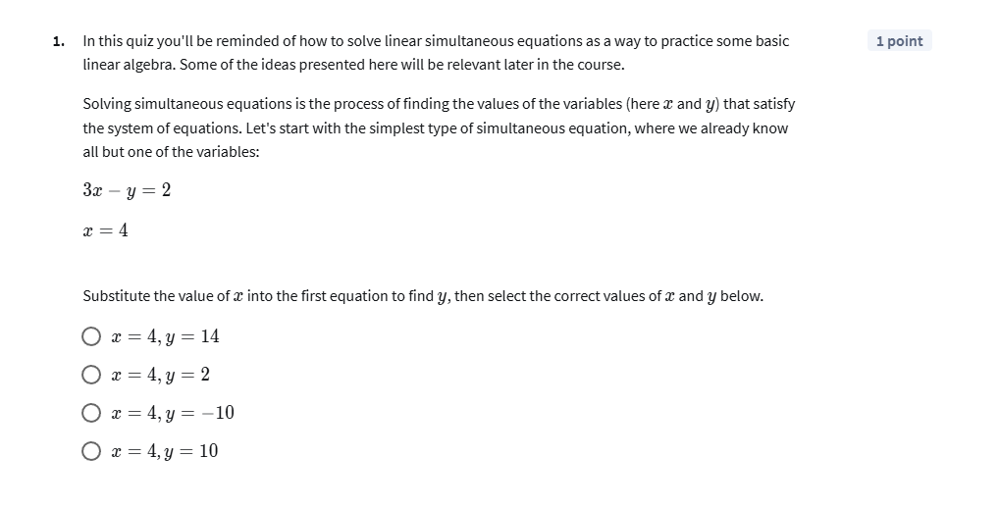

# Mathematics for Machine Learning: Linear Algebra

Coursera - Imperial College London

Link to [Course](https://www.coursera.org/learn/linear-algebra-machine-learning)

## Getting a handle on vectors
선형대수학을 공부하며 `Vector`라는 개념을 먼저 다루는 이유는 데이터 분석에서 `Vector`가 갖는 중요성을 직관적으로 이해하기 위함

예시로 사람들의 키 데이터를 가정
- 히스토그램으로 나타낸다면, 사람들의 키는 대부분 일정 범위 안에 위치
- 대략적으로 1.5m ~ 2m 사이에 대부분이 분포할 것
- 이러한 키 분포 데이터를 **수학적 식(equation)**을 사용하여 모델링하고자
- 다시 말해, 인구 전체의 키 분포가 가진 특징을 잘 나타내는 하나의 함수로 데이터를 **근사(fitting)**
- 이때 수학적 모델은 몇 가지의 **매개변수(Parameter)**를 가지고 있음
- 예제로서 간단히 μ와 σ를 사용하는 Normal Distribution 혹은 Gaussian Distribution이라는 모델을 가정
- 우리는 이 분포를 데이터에 맞추기 위해
- 즉, 데이터를 설명하는 **최적의 μ와 σ**를 찾기 위해
- 두 곡선 사이의 오차를 최소화하는 최적의 Parameter를 찾아야 함
- 일반적으로 오차를 수치적으로 표현할 때는, 각 지점에서 실제 데이터와 예측 모델 값의 차이의 제곱을 더한 합을 사용
- Sum of Squared Residualss: **SSR**
- 이것을 **Goodness of fit**의 측도로 사용
- 이 값이 작을수록 좋은 모델이라 할 수 있음
- 우리가 하고자 하는 것은 이 SSR이 최소가 되는 최적의 Parameter를 찾는 것
- 다양한 μ와 σ에 따른 오차값을 계산하여 2차원 그래프로 시각화
- 등고선 지도와 같은 형태로 Parameter가 최적인 지점에서 오차가 최소
- Parameter Space라는 개념을 이해할 수 있음
- 모델의 Parameter 값으로 이루어진 공간이며, 여기서 Parameter 값은 좌표의 역할을 함
- 이 공간에서 Parameter 값을 조정하는 움직임을 `Vector`로 표현할 수 있음
- Parameter Space에서의 움직임을 Vector로 이해하면 데이터 분석에서의 Optimization 문제가 더욱 명확해짐
- 결국 데이터 분석이란 데이터와 가장 잘 맞는 모델을 찾기 위해 Parameter Space에서 가장 낮은 오차를 주는 지점을 찾는 문제
- 이 과정에서 **미적분(Calculus)**을 이용해 **Gradient**를 계산하고 **Minima**를 찾는 것


## Practice Assignment
### 1. Exploring parameter Space
1차 시기에는 50점, 커트라인은 40점으로 통과 가능했으나
재시험에 응시하여 87.5점 Pass


### 2. Solving some simultaneous equations
간단한 선형연립방정식, 늦은 밤에 암산으로 푸느라 스트레스 받았지만 다행히 100점 Pass




## Operations with vectors
일반적으로 `Vector`는 *공간에서의 움직임*을 나타내는 Object라고 생각할 수 있다. 여기서 말하는 공간은 물리적인 공간뿐 아니라, **데이터**를 나타내는 공간일 수도 있다.

### Vector operations
`Vector`는 다음 두 가지 연산 규칙을 만족해야 함
1. Vector Addition
   - 두 Vector r과 s의 덧셈은
   - v의 끝 점에 s를 연결하여 나타냄
   - 교환 법칙을 만족함
2. Scalar Multiplication
   - Vector에 숫자를 곱하여 길이를 조정할 수 있음
   - 양의 Scalar는 길이를 배수만큼 늘리고
   - 음의 Scalar는 방향을 반대로 바꿈

```makefile
r = [3, 2], s = [-1, 2] 일 때,

r + s = [3 + (-1), 2 + 2] = [2, 4]
r - s = [3 - (-1), 2 - 2] = [4, 0]

r - s = r + (-1)*s

(r + s) + t = r + (s + t)
```

### Basis vectors
벡터 연산을 편리하게 하기 위해서는 Coordinate system을 설정하는 것이 유용하다. 좌표계는 일반적으로 기저 벡터(Basis vectors)를 사용하여 구성된다.
- i: 수평 방향으로 길이가 1인 벡터
- j: 수직 방향으로 길이가 1인 벡터

## Practice Assignment
### Doing some vector operations

간단한 사칙연산, 쉽게 Pass
