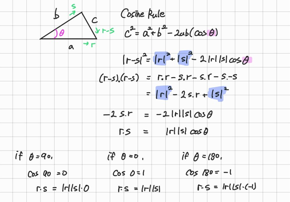
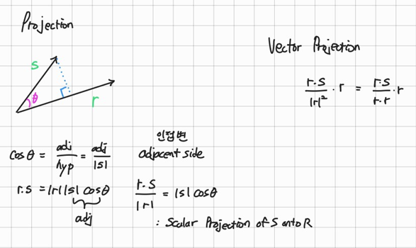

# Mathematics for Machine Learning: Linear Algebra

Coursera - Imperial College London

Link to [Course](https://www.coursera.org/learn/linear-algebra-machine-learning)

## Modulus and inner product
- `Vector`는 length와 direction을 가지고 있음
- 서로 orthogonal(직교)하는 두 개의 unit vector를 i와 j를 사용해 좌표계를 설정
- 임의의 vector `r`은 다음과 같이 표현
>  r=a⋅i+b⋅j
- Unit vector는 길이가 1인 vector
  - hat 기호를 써서 나타냄
- Pythagoras theorem을 이용하면 vector `r`의 길이는 

$$ ∣r∣= \sqrt{(a^2+b^2)} $$
- 이 표현은 좌표계를 사용하는 vector의 일반적인 크기 정의

### Dot product
- 내적, dot product는 두 vector를 곱하는 방법 중 하나
- 두 vector `r`과 `s`가 있을 때, 각각의 성분을 곱하고 그 합을 구함
$$r⋅s=(r_i​ * s_i​)+(r_j​ * s_j)$$
- Dot product의 결과는 vector가 아니라 `Scalar`, 즉 숫자 하나
  
### Properties of dot product
1. 교환 법칙(Commutative)
- Dot product는 두 vector의 순서를 바꿔도 결과가 변하지 않음
$$ r⋅s=s⋅r $$

2. 분배 법칙(Distributive over Addition)
- 덧셈에 대해 분배 법칙을 만족
- 세 vector `r`, `s`, `t`가 있을 때
$$ r⋅(s+t)=r⋅s+r⋅t $$

3. 스칼라 곱에 대한 결합 법칙(Associativity over Scalar Multiplication)
- Scalar 곱에 대해 결합 법칙 만족
- Scalar `a`가 있을 때
$$ r⋅(as)=a(r⋅s) $$
​

### Dot product과 modulus의 관계
- Vector를 **자기 자신과 내적**하면 각 성분의 제곱 합을 얻음
$$ r⋅r=r_1^2​ +r_2^2​ +⋯+r_n^2 $$

- ​이 값은 vector의 크기 제곱과 동일
$$ r⋅r=∣r∣^2 $$

- Vector의 크기를 구할 때는 다음과 같은 편리한 공식 성립
$$ |r| = \sqrt{r⋅r} $$

### Summary
벡터의 기본 연산(덧셈, 스칼라 곱)을 통해 벡터를 정의할 수 있다.

벡터의 크기(length)는 각 성분의 제곱 합의 제곱근으로 정의된다.

내적(dot product)은 벡터 간 곱의 한 종류이며, 결과는 숫자(스칼라)이다.

내적은 교환법칙, 분배법칙, 스칼라 곱에 대한 결합법칙을 만족한다.

벡터의 크기와 내적 사이에는 다음과 같은 중요한 관계가 있다:

$$ |r| = \sqrt{r⋅r} $$
​
## Cosine and dot product
### Cosine rule
- 길이가 `a`, `b`, `c`인 세 변으로 이루어진 삼각형
$$ c^2 =a^2 +b^2 −2abcosθ $$
- θ는 변 𝑎와 변 𝑏 사이의 각도
- Vector 표현으로 바꿔보자
- `r`, `s`가 있고 그 사이 각도를 θ
- 두 vector를 이용하여 삼각형을 만들 수 있고
- Vector의 뺄셈(r-s)을 이용하면 세 번째 변은 Vector `r-s`로 표현
- Cosine rule을 Vector 표기법으로 다시 쓰면 다음과 같음
$$ ∣r−s∣^2 =∣r∣^2 +∣s∣^2 −2∣r∣∣s∣cosθ $$

- 여기서 ∣𝑟∣, ∣𝑠∣는 각각 벡터 𝑟과 𝑠의 크기(길이)를 나타냄

### Vector dot product를 이용한 전개
- 임의의 벡터의 크기의 제곱은 자기 자신과 내적한 값과 같다.

$$ ∣r−s∣^2 =(r−s)⋅(r−s)$$

전개하면
$$ (r−s)⋅(r−s)=r⋅r−r⋅s−s⋅r+s⋅s $$

이를 간단하게 정리하면,

최종적으로 아주 중요한 내적의 정의를 얻을 수 있음

$$ r⋅s=∣r∣∣s∣cosθ $$

### Dot product의 의미 해석
- 내적은 두 vector의 크기와 사이의 각도의 Cosine 값에 따라 결정됨
1. 두 vector가 같은 방향을 향하면
- theta가 0이므로 두 vector 크기에 1을 곱함
- 이때 내적이 최대값이며 항상 양수
2. 두 vector가 직각으로 만나면
- theta가 90이므로 0을 곱함
- 이때 내적은 0이 됨
- 두 vector는 orthogonal 
3. 두 vector가 정반대 방향이면
- theta가 180이므로 (-1)을 곱함
- 내적은 음수가 되며
- 방향은 서로 반대

#### Vector간 방향성의 정량화
내적을 통해 우리는 두 vector가 얼마나 **비슷한 방향**을 향하고 있는지 알 수 있음

**내적 값이**
- 크고 양수일수록 두 vector는 거의 같은 방향
- 0에 가까울수록 두 vector는 직교
- 음수일수록 두 vector는 반대 방향

## Projection
### Scalar projection
- 두 vector `r`, `s`가 있을 때 `s`를 `r`위에 투영
- 두 vector 사이 각도 θ가 있음
- Cosine을 이용해 각도 θ의 Adjacent side(인접변)의 길이를 구할 수 있음

$$ cosθ= 인접변의 길이/∣S∣ ​$$

R⋅S=∣R∣∣S∣cosθ 에서

∣𝑆∣cos⁡𝜃 부분은 바로 벡터 𝑆를 벡터 𝑅 위에 투영했을 때의 길이(인접변의 길이)와 정확히 일치

벡터 𝑅 방향으로 𝑆가 만든 **그림자**의 길이가 바로 투영
만약 벡터 𝑆가 벡터 𝑅에 직각(orthogonal)이라면, 투영 길이는 0이 될 것

$$ Scalar Projection of S onto R= \frac{R⋅S}{∣R∣} $$
- 이는 Scalar이며 vector `S`가 `R` 방향으로 얼마나 겹쳐있는 지 나타내는 양

### Vector projection
- Scalar projection은 방향성이 없음
- 방향 정보를 포함하기 위해 vector projection을 사용
  
$$ Vector Projection of S onto R = (\frac{R⋅S}{∣R∣^2})*R$$ 
- Scalar projection에 vector `R`의 방향을 나타내는 unit vector를 곱한 것
  
𝑅 / ∣𝑅∣ 는 벡터 𝑅의 단위벡터(unit vector)이며, 벡터 투영은 벡터 𝑅 방향으로 향하는 하나의 벡터임

- 스칼라 투영: 벡터가 다른 벡터 방향으로 얼마나 겹쳐 있는지의 크기(길이)만을 나타낸다.

- 벡터 투영: 스칼라 투영과 더불어 방향 정보까지 나타내는 완전한 벡터로, 다른 벡터 방향으로 실제로 "겹쳐진" 벡터를 표현한다.

$$ Vector projection of S onto R=(\frac{R⋅S}{∣R∣}​ )\frac{R}{∣R∣} $$

앞부분인 𝑅⋅𝑆 / ∣𝑅∣ 는 스칼라 투영이며, 
뒷부분인 𝑅 / ∣𝑅∣​ 은 방향을 나타내는 단위벡터

### 직관적 이해

벡터 투영의 직관적 이해를 돕기 위해 예시를 들어보면 다음과 같습니다.

벡터 𝑆 위에 수직으로 빛을 비추어서 벡터 𝑅 방향으로 그림자를 만든다고 상상해 봅시다.

이때 만들어진 그림자의 길이가 스칼라 투영입니다.

그런데 우리는 이 그림자의 길이뿐만 아니라 그림자의 방향까지도 정확히 표현하고 싶습니다. 이때 벡터 투영이 필요합니다.

벡터 투영은 "그림자의 길이와 방향을 모두 포함한 벡터"입니다.

즉, 벡터 투영은 원래 벡터 𝑅과 같은 방향으로 향하며, 그 크기는 스칼라 투영의 크기와 같습니다.

### Practice Assignment
83.33점 pass

## Chaning basis
- 기저 변환
- 한 좌표계에서 다른 좌표계로 vector를 변환하는 방법(changing basis)
- Vector `r`은 원점(origin)에서 출발하여 공간 상 어떤 지점으로 향하는 기하학적 객체
- 일반적으로 orthogonal unit vectors `e1`, `e2`로 이루어진 좌표계를 사용
  
  
예를 들어,

단위벡터 
𝑒1=[1,0], 𝑒2=[0,1]을 기준으로 벡터 𝑟이 "3칸 오른쪽, 4칸 위"를 의미한다면,

$$𝑟=3𝑒1+4𝑒2=[3,4]$$

- 좌표계를 정하는 방식은 임의적
- 반드시 unit vectors거나 직각일 필요 없음
- 임의의 다른 vector `b1`, `b2`로 좌표계를 정의하면 기존 vector `r`도 새로운 좌표계의 숫자 조합으로 표현 가능
- 이러한 기준 vectors를 **Basis vectors**라고 부름
- 벡터 𝑟이 𝑒 기저에서는 [3,4]이지만, 𝑏 기저에서는 다른 숫자로 나타날 것

### Orthogonal unit vectors를 활용환 좌표 변환

- 새로운 basis vectors `b``, `b2`가 orthogona하는 경우, dot product를 활용해 좌표 변환 가능
- 새로운 기저 벡터 𝑏1,𝑏2​ 가 다음과 같이 정의되어 있다고 하자.

$$𝑏1=[2,1], 𝑏2=[−2,4]$$

두 기저 벡터가 직교하는지 확인하려면 내적 계산

→ 내적 값은 0이므로 직교함

### Projection을 이용한 좌표 변환
- Vector `r`을 `b1`, `b2`의 방향으로 projection
  
1. b1 방향으로 투영
$$ Proj_{b_1}​ (r)= \frac{10}{5}​b_1​ =2[2,1]=[4,2] $$
2. b1 방향으로 투영
$$ Proj_{b_2}​ (r)= \frac{10}{20}​b_2​ =\frac{1}{2}[-2,4]=[-1,2] $$

3. 두 projection의 합으로 원래 vector 확인
- 두 vector projection을 더하면 원래 vector `r`로 돌아옴

$$ Proj𝑏1(𝑟)+Proj𝑏2(𝑟)=[4,2]+[−1,2]=[3,4]$$

### 새로운 기저에서의 좌표값 표현
- Vector `r`은 새로운 basis vector `b1`, `b2`를 기준으로 다음과 같은 좌표값을 가짐
$$ r = 2b_1 + \frac{1}{2}b_2$$

### Summary
벡터는 좌표계와 독립적으로 존재하는 수학적 객체이다.

벡터를 표현하는 좌표계는 임의적이며, 필요에 따라 변경할 수 있다.

직교(orthogonal)하는 새로운 좌표계를 사용하면, 내적을 활용하여 손쉽게 좌표 변환을 수행할 수 있다.

벡터 투영(projection)을 이용하면 벡터를 새로운 기저 벡터의 좌표계로 간단히 나타낼 수 있다.

### Practice Assignment: Changing basis
100점 pass

## Basis, vector space, and linear independence
### Basis is a set of n vectors that
- 서로가 서로의 linear combination으로 표현되지 않음
- 따라서 서로가 linearly independent임
- 이 vector들의 모든 가능한 선형 결합이 vector 공간 전체를 나타냄
- 즉, 공간을 span함
- Basis vector들이 n개라면 그 vector 공간은 n-dimensional

### Linear independence의 의미
- 특정 vector를 다른 vector들간의 linear combination으로 나타낼 수 없음
- 만약 어떤 vector가 다른 vector들의 선형 결합으로 나타내어진다면, 그 vector는 linearly dependent임

만약

$$ b 3​ =a 1​ b 1 +a 2​ b 2$$
여기서, a1, a2가 Scalar일 때

이것이 성립한다면, b3는 기존 두 vector와 같은 평면에 놓이며 **선형 종속**임

### Basis vector의 특성
기저 벡터로 선택하는 벡터들은 다음과 같은 조건을 반드시 만족해야 함

- 서로 선형 독립이어야 한다.

- 서로의 선형 결합을 통해 공간 전체를 표현할 수 있어야 한다(공간을 생성).

다만, 다음과 같은 조건은 필수적이지 않지만 실질적으로는 편리하기 때문에 자주 사용됨

- 벡터들이 길이가 1인 unit vectors 이면 계산이 편리하다.

- 벡터들이 서로 orthogonal이면 더욱 계산이 편리하다.

이렇게 길이가 1이고 직교하는 기저 벡터의 집합을 정규 직교 기저(orthonormal basis) 라고 부름

### 좌표계의 변환과 기저의 변경
Basis vector를 변경할 때, 기존의 좌표축을 새 좌표축 위로 projection함

이때 다음과 같은 특징

- 좌표계의 축을 변경하면 벡터를 나타내는 성분 값은 달라질 수 있다.

- 그러나 이 좌표 변환은 여전히 벡터 공간의 규칙성을 유지한다.

- 벡터의 덧셈(vector addition)이나 스칼라 곱(scalar multiplication)과 같은 기본적인 선형 연산(linear operations)은 그대로 유지된다.

- 이런 변환 과정에서 공간은 휘거나 비틀어지지 않고, 단지 회전, 늘어남, 축소와 같은 선형(linear) 변환만이 일어난다. 바로 이 "선형성"이 선형대수(linear algebra)라는 이름의 핵심이다.

### Summary
- Basis : 벡터 공간을 생성하는 선형 독립인 벡터들의 집합.

- Linear independence : 어떤 벡터가 다른 벡터의 선형 결합으로 표현될 수 없다는 의미.

- 기저 벡터의 개수가 벡터 공간의 차원을 정의한다.

- 기저는 반드시 단위벡터나 직교 벡터일 필요는 없지만, 그렇게 하면 계산이 편리해진다.

- 좌표계를 변경하는 과정에서 선형성은 유지되며, 공간 자체가 변형되지는 않는다.

- 직교 기저를 선택하면 dot product을 통해 손쉽게 좌표 변환이 가능하며, 직교하지 않으면 matrix을 이용한 보다 일반적인 변환이 필요하다.

